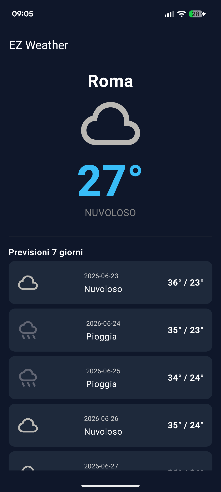
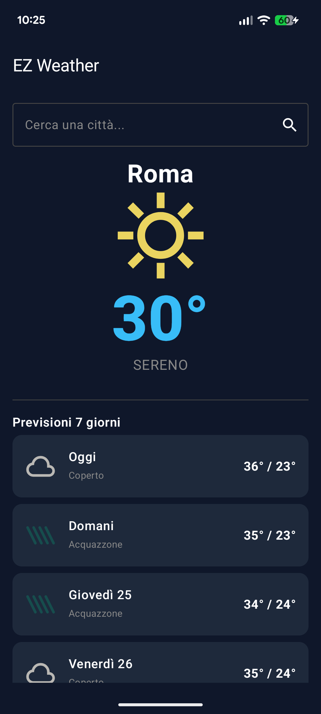
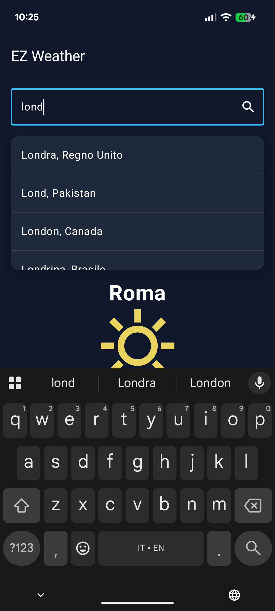

# ⛅ EZ Weather

A modern, reactive Android weather application built entirely with **Jetpack Compose** and **Kotlin**.

This showcase project demonstrates the implementation of a clean MVVM architecture, robust dependency injection, and seamless asynchronous data handling. It relies on the **Open-Meteo API**, ensuring a 100% keyless and privacy-friendly data fetching approach.

## ✨ Key Features

* **Dynamic Search with Debouncing:** A real-time city search bar that implements coroutine-based debouncing to minimize unnecessary network requests.
* **Smart Autocomplete:** Displays a dropdown of city suggestions (via Geocoding API) while typing.
* **Current Weather & 7-Day Forecast:** Displays comprehensive weather data including beautiful, dynamic icons mapping Open-Meteo weather codes.
* **Modern UI/UX:** Built completely with Jetpack Compose Material 3, featuring reactive state management (`collectAsStateWithLifecycle`) and smooth keyboard handling.
* **Error Handling:** Graceful error states and visual feedback (Loading indicators) for network delays.

## 🛠️ Tech Stack & Libraries

* **UI:** [Jetpack Compose](https://developer.android.com/jetpack/compose) (Material 3)
* **Architecture:** MVVM (Model-View-ViewModel)
* **Dependency Injection:** [Dagger Hilt](https://dagger.dev/hilt/)
* **Network:** [Retrofit2](https://square.github.io/retrofit/) & OkHttp
* **Asynchronous Programming:** [Kotlin Coroutines](https://kotlinlang.org/docs/coroutines-overview.html) & [StateFlow](https://developer.android.com/kotlin/flow/stateflow-and-sharedflow)
* **Image Loading:** [Coil Compose](https://coil-kt.github.io/coil/compose/)
* **API:** [Open-Meteo](https://open-meteo.com/) (Geocoding & Forecast)

## 🏗️ Architecture Overview

The app strictly follows a unidirectional data flow and separation of concerns:
1.  **UI Layer (`screens`):** Composable functions that observe UI state via `StateFlow` from the ViewModel.
2.  **Presentation Layer (`ViewModel`):** Manages the logic, holds the state (`Resource.Loading`, `Success`, `Error`), and handles the debouncing of the search queries.
3.  **Data Layer (`repository` & `network`):** The `WeatherRepository` abstracts the network calls, combining Geocoding and Weather forecast APIs into a single source of truth for the ViewModel.

## 🚀 Getting Started

Since this project uses the Open-Meteo API, there are **no API keys to configure**. The app works completely out of the box!

1. Clone the repository:
   ```bash
   git clone [https://github.com/emanuele400tt/weather-app.git](https://github.com/emanuele400tt/weather-app.git)
2. Open the project in Android Studio (Koala or newer recommended).

3. Let Gradle sync and download the dependencies.

4. Click Run to launch the app on your emulator or physical device.

## App Preview
## 📱 Screenshot

| Home screen | Search bar |   
| :---: | :---: |
|  |  |  | 

## Versione italiana

Una moderna e reattiva applicazione meteo per Android, sviluppata interamente con **Jetpack Compose** e **Kotlin**.

Questo progetto "showcase" dimostra l'implementazione di un'architettura MVVM pulita, una solida dependency injection e una gestione fluida dei dati asincroni. L'app si basa sull'**API di Open-Meteo**, garantendo un approccio al recupero dei dati 100% "keyless" (nessuna chiave API richiesta) e attento alla privacy.

## ✨ Funzionalità Principali

* **Ricerca Dinamica con Debouncing:** Una barra di ricerca delle città in tempo reale che implementa il "debouncing" tramite coroutines per ridurre al minimo le richieste di rete non necessarie.
* **Autocompletamento Intelligente:** Mostra un menu a tendina con i suggerimenti delle città (tramite l'API di Geocoding) durante la digitazione.
* **Meteo Attuale e Previsioni a 7 Giorni:** Visualizza dati meteorologici completi con icone moderne e dinamiche basate sulla mappatura dei codici meteo di Open-Meteo.
* **UI/UX Moderna:** Costruita interamente con Jetpack Compose (Material 3), sfrutta una gestione reattiva dello stato (`collectAsStateWithLifecycle`) e una chiusura automatica e fluida della tastiera.
* **Gestione degli Errori:** Gestione elegante degli stati di errore e feedback visivo (indicatori di caricamento) per i tempi di attesa della rete.

## 🛠️ Tecnologie e Librerie

* **Interfaccia Grafica (UI):** [Jetpack Compose](https://developer.android.com/jetpack/compose) (Material 3)
* **Architettura:** MVVM (Model-View-ViewModel)
* **Dependency Injection:** [Dagger Hilt](https://dagger.dev/hilt/)
* **Rete (Network):** [Retrofit2](https://square.github.io/retrofit/) & OkHttp
* **Programmazione Asincrona:** [Kotlin Coroutines](https://kotlinlang.org/docs/coroutines-overview.html) & [StateFlow](https://developer.android.com/kotlin/flow/stateflow-and-sharedflow)
* **Caricamento Immagini:** [Coil Compose](https://coil-kt.github.io/coil/compose/)
* **API:** [Open-Meteo](https://open-meteo.com/) (Geocoding & Forecast)

## 🏗️ Panoramica dell'Architettura

L'app segue rigorosamente un flusso di dati unidirezionale (Unidirectional Data Flow) e la separazione delle responsabilità (Separation of Concerns):
1.  **Livello UI (`screens`):** Funzioni Composable che osservano lo stato dell'interfaccia tramite `StateFlow` emessi dal ViewModel.
2.  **Livello di Presentazione (`ViewModel`):** Gestisce la logica di business, mantiene lo stato dell'app (`Resource.Loading`, `Success`, `Error`) e gestisce le tempistiche (debouncing) delle query di ricerca.
3.  **Livello Dati (`repository` & `network`):** Il `WeatherRepository` astrae la complessità delle chiamate di rete, combinando le API di Geocoding e quelle delle previsioni meteo in un'unica fonte di verità (Single Source of Truth) per il ViewModel.

## 🚀 Come Iniziare

Poiché questo progetto utilizza l'API di Open-Meteo, **non ci sono chiavi API da configurare**. L'app funziona perfettamente "out of the box" (subito dopo il download)!

1. Clona la repository:
   ```bash
   git clone [https://github.com/emanuele400tt/weather-app.git](https://github.com/emanuele400tt/weather-app.git)
2. Apri il progetto su Android Studio (versione Koala o superiore consigliata).

3. Attendi la sincronizzazione di Gradle e il download delle dipendenze.

4. Clicca su Run per avviare l'app sul tuo emulatore o dispositivo fisico.
